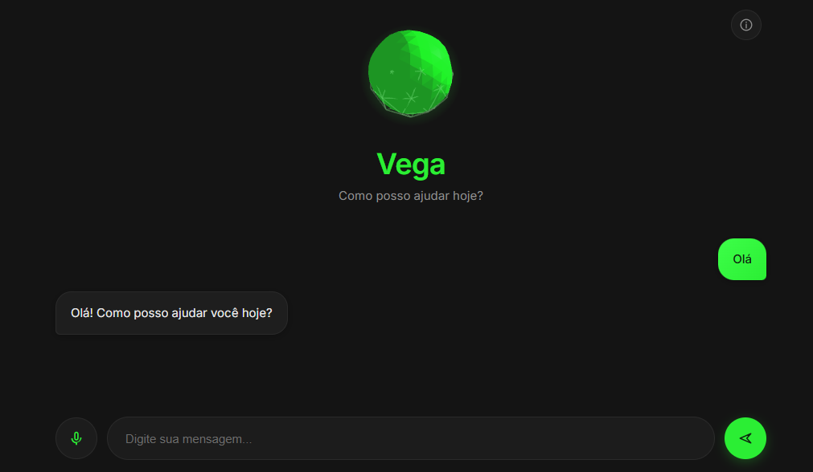

# Vega Assistant Web

<p align="center">
  
</p>

<p align="center">
  
  
  
</p>

Vega Assistant é um assistente virtual desenvolvido com **Flask** e **JavaScript**, capaz de interpretar comandos de voz, responder utilizando modelos de IA através da OpenRouter e fornecer informações em tempo real, como clima e horário. A interface conta com uma esfera 3D animada construída com Three.js que reage durante a interação.

## Funcionalidades

- Conversa com IA utilizando OpenRouter
- Reconhecimento de voz (Web Speech API)
- Síntese de voz
- Consulta de clima em tempo real
- Consulta de horário
- Interface com animação 3D utilizando Three.js

## Tecnologias

- Python 3.11+
- Flask
- JavaScript (ES6)
- Three.js
- OpenRouter
- Open-Meteo API
- Web Speech API
- Gunicorn

## Pré-requisitos

- Python 3.11 ou superior
- pip
- Chave de API da OpenRouter
- Navegador compatível com Web Speech API (Chrome ou Edge)

## Instalação

Clone o repositório:

```bash
git clone https://github.com/Marcus-Jr/vega-assistant-web.git
cd vega-assistant-web
```

Crie um ambiente virtual:

```bash
python -m venv .venv
```

Ative o ambiente:

**Windows**

```bash
.venv\Scripts\activate
```

**Linux/macOS**

```bash
source .venv/bin/activate
```

Instale as dependências:

```bash
pip install -r requirements.txt
```

Crie um arquivo `.env`:

```env
OPENROUTER_API_KEY=sua_chave
OPENROUTER_MODEL=nemotron-3-ultra-550b-a55b:free
```

Execute a aplicação:

```bash
python app.py
```

A aplicação estará disponível em:

```
http://127.0.0.1:5000
```

## Estrutura do projeto

```
vega-assistant-web/
├── routes/
├── services/
├── static/
├── templates/
├── app.py
├── requirements.txt
└── .env
```

## Implantação

O projeto pode ser executado em produção utilizando Gunicorn:

```bash
gunicorn app:app
```

Lembre-se de configurar as variáveis de ambiente no servidor.

## Testes

Atualmente o projeto não possui testes automatizados.

As principais funcionalidades podem ser verificadas manualmente:

- envio de mensagens;
- reconhecimento de voz;
- síntese de voz;
- consulta de horário;
- consulta de clima.

## Autor

**Marcus Everton De França Junior**

GitHub: https://github.com/Marcus-Jr
